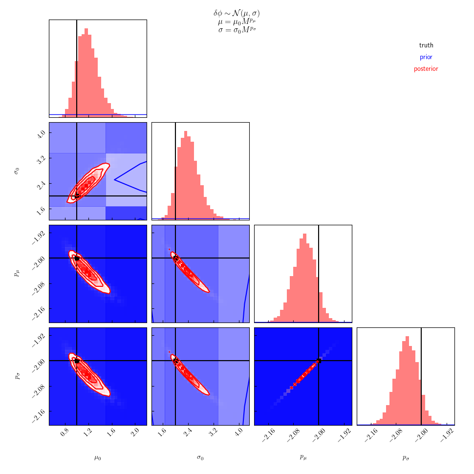
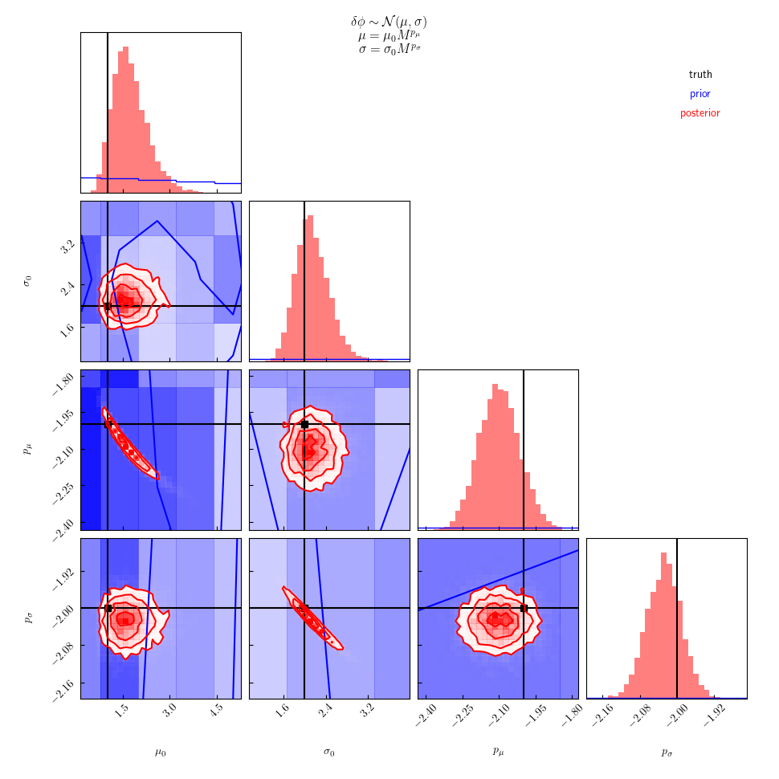
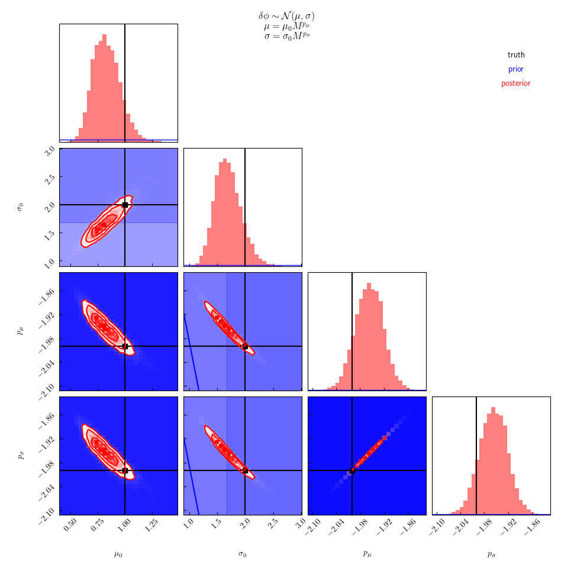

Workflow should go something like:

```
for MODE in scaled_normal scaled_exp_abs scaled_exp scaled_normal_q
do
    ./generate 1000 catalog_${MODE}.hdf --seed 123 -v
    ./infer catalog_${MODE}.hdf samples_${MODE}.hdf --seed 456 -v
    ./infer catalog_${MODE}.hdf samples_${MODE}_one_scaling.hdf --one-scaling --seed 456 -v
done
```

**NOTE**, we may also set up p-p test to demonstrate propper coverage?

---

## Examples:

All examples are recovered using the same model:
```math
\delta\phi \sim \mathcal{N}(\mu_0 M^{p_\mu}, \sigma_0 M^{p_\sigma})
```
The posterior labeled "one scaling" are for a nested model with the additional prior constraint that
```math
p_\mu = p_\sigma
```

### `scaled_normal`

The catalog is generated with the same model that's used during recovery
```math
\delta\phi \sim \mathcal{N}(\mu_0 M^{p_\mu}, \sigma_0 M^{p_\sigma})
```
We expect good recovery, and this is observed.

|catalog|posterior|posterior(one scaling)|
|---|---|
||||

### `scaled_exp_abs`

The catalog is generated with a different model than what's used during recovery.
This model is symmetric and has the correct scaling of moments with `M`.
However, it is not Gaussian.
```math
\delta\phi \sim \frac{\gamma}{2} \exp\left(-\gamma|\delta\phi - \mu|\right)
```
for which
```math
\sigma^2 = 2/\gamma^2
```
We expect good recovery of the first 2 moments, and this is what's observed.
 
|catalog|posterior|posterior(one scaling)|
|---|---|
||||

### `scaled_exp`

This catalog is generated with a different model than what's used during recovery.
This model has the correct scaling of moments with `M`, but is asymmetric (and therefore is not Gaussian).
```math
\delta\phi \sim \gamma \exp\left(-\gamma (\delta \phi - a)\right) \Theta(\delta \phi \geq a)
```
In this case
```math
\mu = a + \frac{1}{\gamma}
```
and
```math
\sigma = \frac{1}{\gamma}
```
We expect good recovery of the first 2 moments, even though the true distribution is not symmetric.
This is what's observed.

|catalog|posterior|posterior(one scaling)|
|---|---|
||||

### `scaled_normal_q`

Finally, this catalog is generated with a different model than what's used during recovery.
The model does not have the correct scaling of moments with `M` and additionally depends on `q` in a "relatively strong" way.
The model is Gaussian.
```math
\delta\phi \sim \mathcal{N}(\mu, \sigma)
```
where
```math
\mu = \mu_0 M^{p_\mu} \left(1 - e^{2q}\right)
```
and
```math
\sigma = \sigma_0 M^{p_\sigma} e^{2q}
```
Here, we do not expect good recovery of the first 2 moments because they depend on more than just `M`.
As expected, we observe large biases, although the scaling of the moments with `M` is still recovered reasonably well.

|catalog|posterior|posterior(one scaling)|
|---|---|
||||
