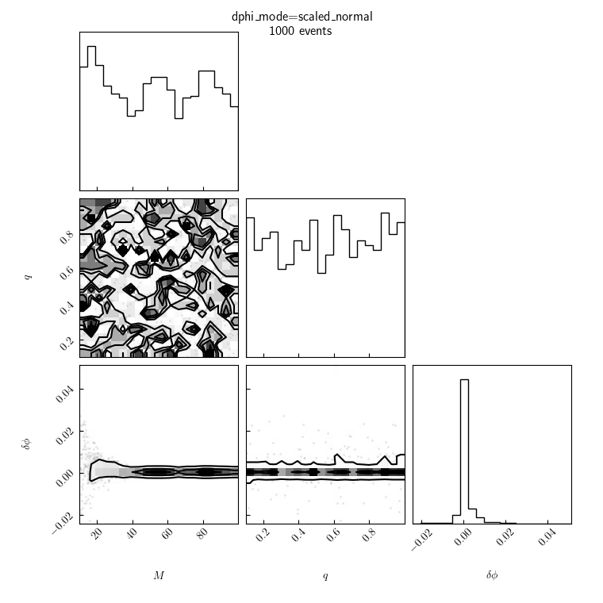
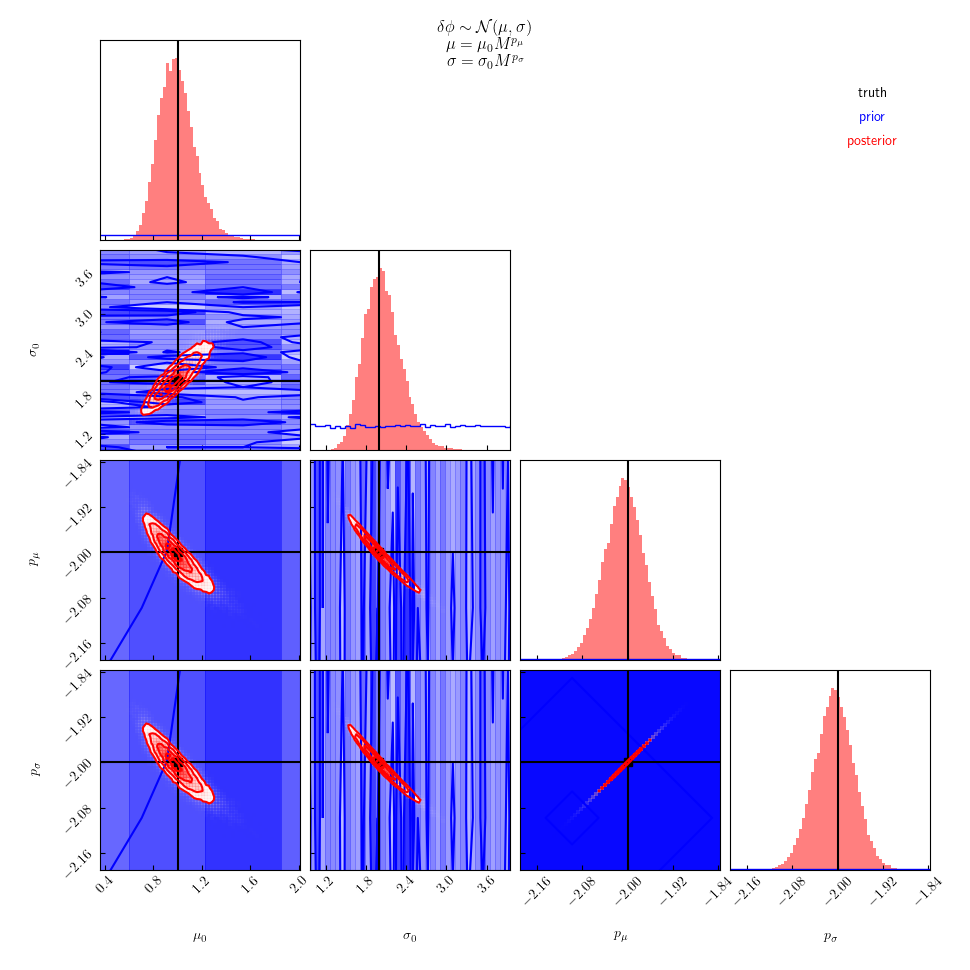
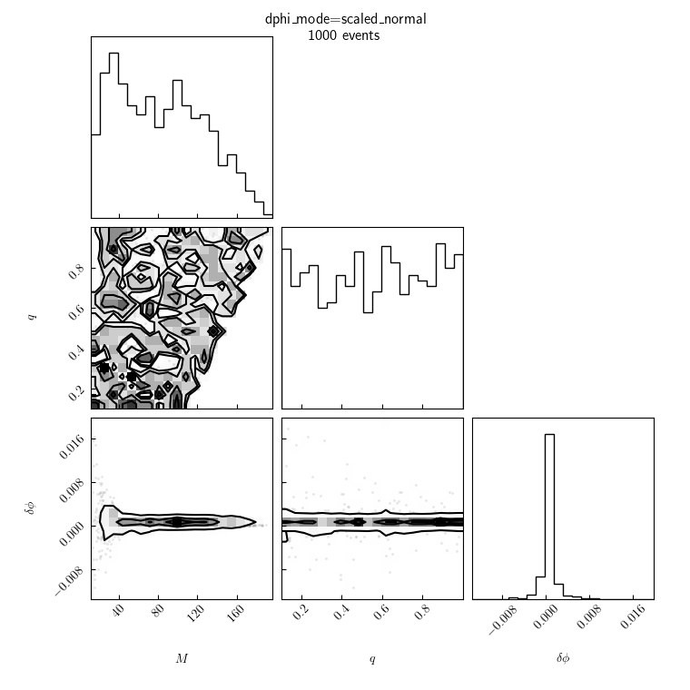
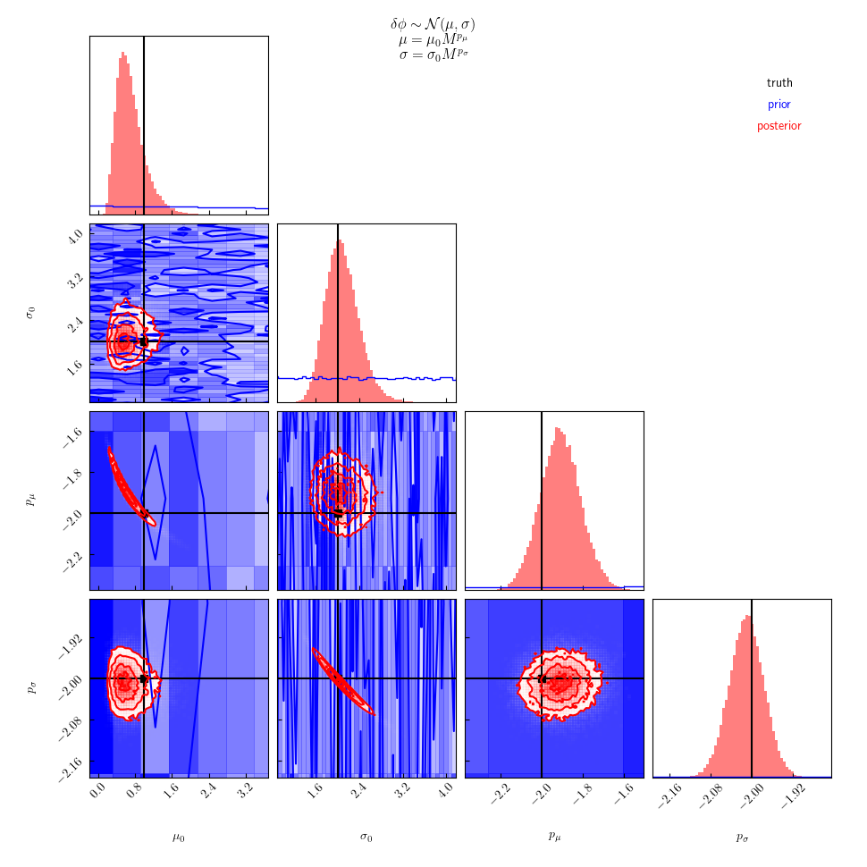
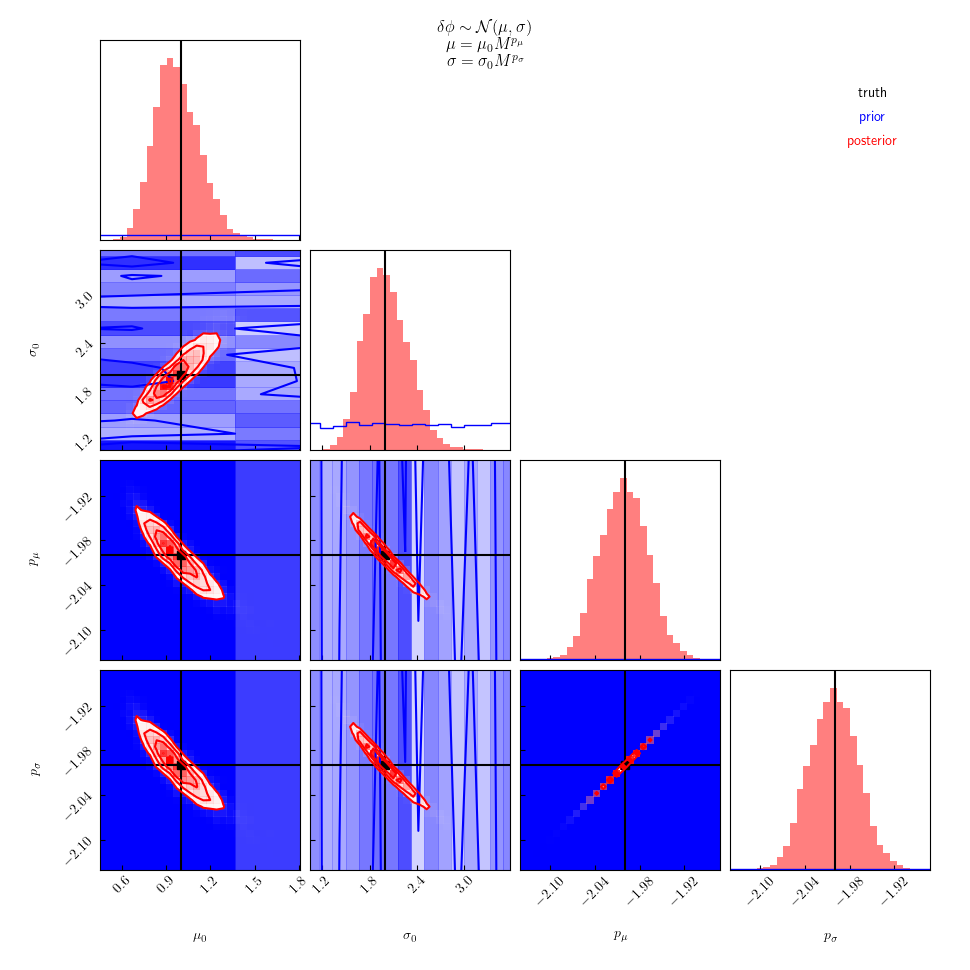
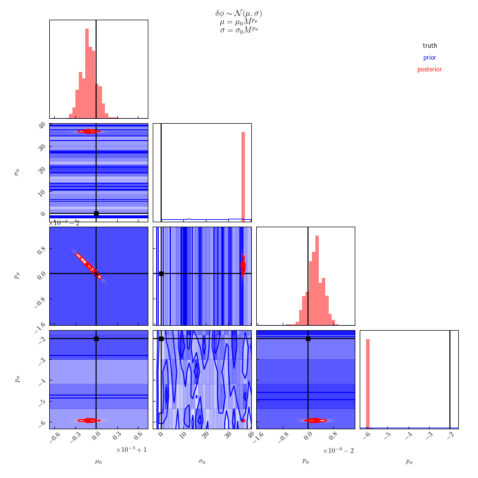
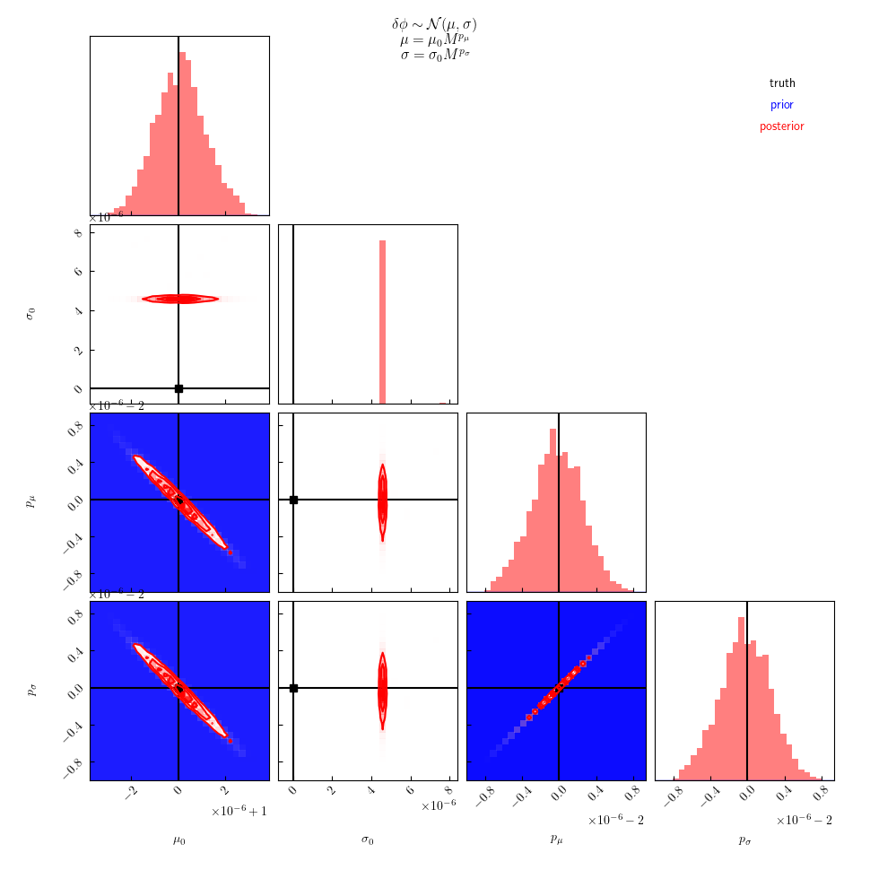
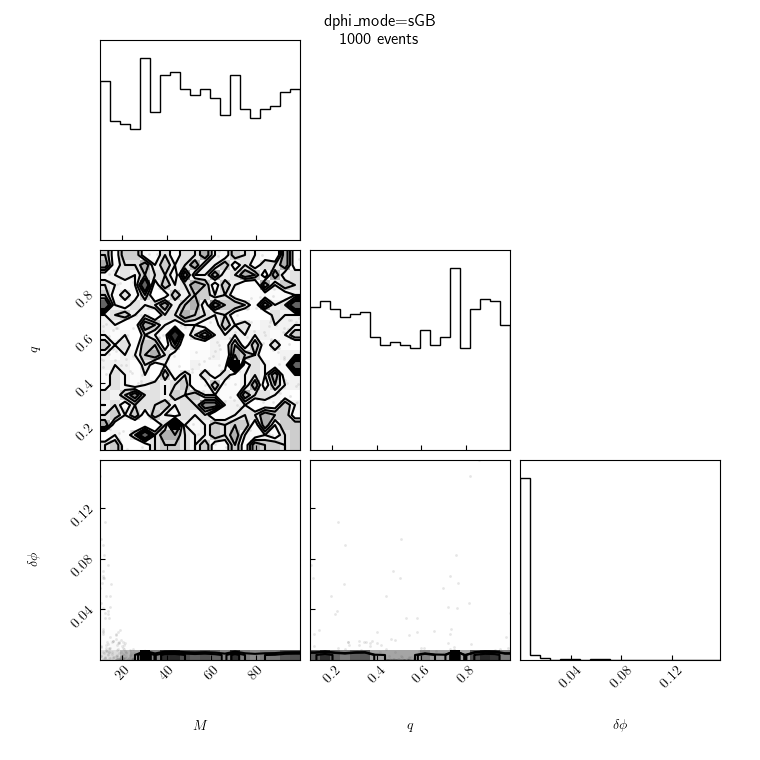
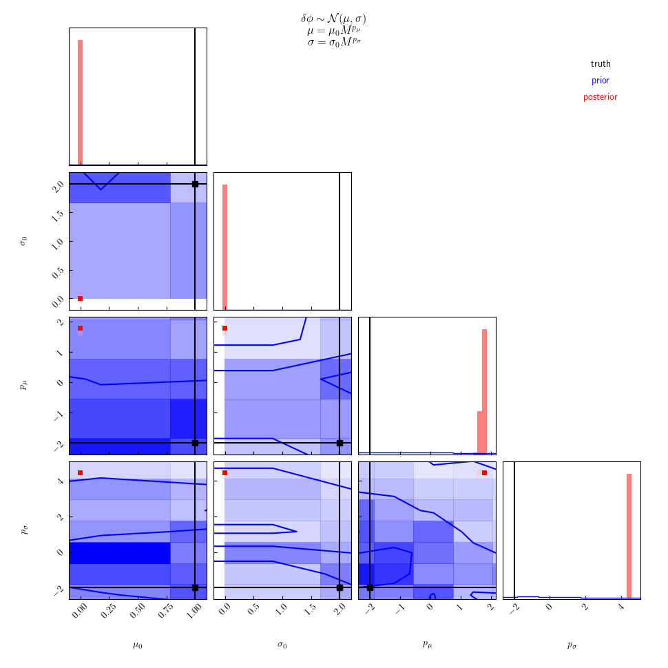
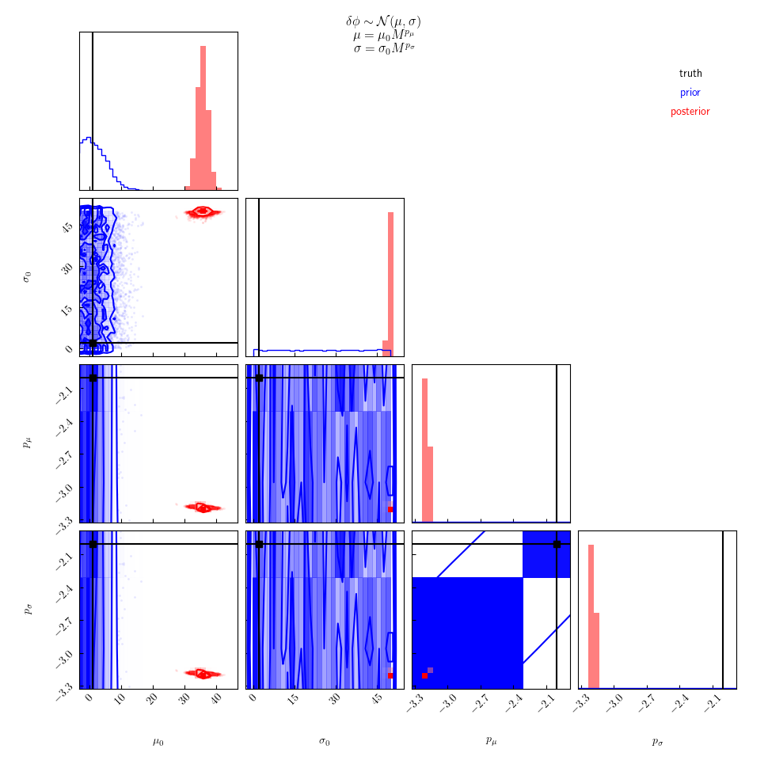

Workflow should go something like:

```
for DPHI_MODE in scaled_normal scaled_exp_abs scaled_exp scaled_normal_q deterministic sGB
do
    for M_MODE in M m1
    do

        ./generate \
            1000 \
            catalog_${DPHI_MODE}-${M_MODE}.hdf \
            --dphi-mode ${DPHI_MODE} \
            --m-mode ${M_MODE} \
            --seed 1234 \
            -v

        ./infer \
            catalog_${DPHI_MODE}-${M_MODE}.hdf \
            samples_${DPHI_MODE}-${M_MODE}.hdf \
            --seed 5678 \
            -v

        ./infer \
            catalog_${DPHI_MODE}-${M_MODE}.hdf \
            samples_${DPHI_MODE}-${M_MODE}_one_scaling.hdf \
            --one-scaling \
            --seed 5678 \
            -v

    done
done
```

**NOTE**, we may also set up p-p test to demonstrate propper coverage.
This can be done with something like
```
mkdir -p different-catalogs
for MODE in scaled_normal scaled_exp_abs scaled_exp scaled_normal_q
do
    for SEED in $(seq 1 50)
    do
        ./generate \
            1000 \
            different-catalogs/catalog_${MODE}-${SEED}.hdf \
            --seed ${SEED} \
            -v

        ./infer \
            different-catalogs/catalog_${MODE}-${SEED}.hdf \
            different-catalogs/samples_${MODE}-${SEED}.hdf \
            --seed 456 \
            -v

        ./infer \
            different-catalogs/catalog_${MODE}-${SEED}.hdf \
            different-catalogs/samples_${MODE}-${SEED}_one_scaling.hdf \
            --one-scaling \
            --seed 456 \
            -v

    done
done
```

---

## Examples:

All examples are recovered using the same model:
```math
\delta\phi \sim \mathcal{N}(\mu_0 M^{p_\mu}, \sigma_0 M^{p_\sigma})
```
The posterior labeled "one scaling" are for a nested model with the additional prior constraint that
```math
p_\mu = p_\sigma
```

### `scaled_normal`

The catalog is generated with the same model that's used during recovery
```math
\delta\phi \sim \mathcal{N}(\mu_0 M^{p_\mu}, \sigma_0 M^{p_\sigma})
```
We expect good recovery, and this is observed.

|mass|catalog|posterior|posterior(one scaling)|
|---|---|---|---|
|M||||
|m1||||

### `scaled_exp_abs`

The catalog is generated with a different model than what's used during recovery.
This model is symmetric and has the correct scaling of moments with `M`.
However, it is not Gaussian.
```math
\delta\phi \sim \frac{\gamma}{2} \exp\left(-\gamma|\delta\phi - \mu|\right)
```
for which
```math
\sigma^2 = 2/\gamma^2
```
We expect good recovery of the first 2 moments, and this is what's observed.
 
|catalog|posterior|posterior(one scaling)|
|---|---|---|
||||

### `scaled_exp`

This catalog is generated with a different model than what's used during recovery.
This model has the correct scaling of moments with `M`, but is asymmetric (and therefore is not Gaussian).
```math
\delta\phi \sim \gamma \exp\left(-\gamma (\delta \phi - a)\right) \Theta(\delta \phi \geq a)
```
In this case
```math
\mu = a + \frac{1}{\gamma}
```
and
```math
\sigma = \frac{1}{\gamma}
```
We expect good recovery of the first 2 moments, even though the true distribution is not symmetric.
This is what's observed.

|catalog|posterior|posterior(one scaling)|
|---|---|---|
||||

### `scaled_normal_q`

Finally, this catalog is generated with a different model than what's used during recovery.
The model does not have the correct scaling of moments with `M` and additionally depends on `q` in a "relatively strong" way.
The model is Gaussian.
```math
\delta\phi \sim \mathcal{N}(\mu, \sigma)
```
where
```math
\mu = \mu_0 M^{p_\mu} \left(1 - e^{2q}\right)
```
and
```math
\sigma = \sigma_0 M^{p_\sigma} e^{2q}
```
Here, we do not expect good recovery of the first 2 moments because they depend on more than just `M`.
As expected, we observe large biases, although the scaling of the moments with `M` is still recovered reasonably well.

|catalog|posterior|posterior(one scaling)|
|---|---|---|
||||

---

### deterministic

This model assumes a deterministic model for `dphi` that should nevertheless be consistent with our recovery model if `stdv0=0`.
```math
\delta\phi = \frac{1}{M^4}
```
This will test whether the assumption that `dphi` is random affects our ability to recover the hyperparameters.

While it appears that there is a bias in the recovered value of `stdv0` and `exp_stdv`, the sampler really just seemed to get stuck in a region of parameter space that nevertheless corresponds to essentially zero with for all relevant masses.
Similarly, if we assume "one scaling", we can introduce a slight bias in the recovery of `exp_mean` if the prior limits `stdv0` to be reasonably large.

|catalog|posterior|posterior(one scaling)|
|---|---|---|
||||

### sGB

Assuming I wrote down the correct functional form for `dphi` in scalar-Gauss-Bonnet, this model generates data using a deterministic function
```math
\delta \phi = \frac{1}{M^4}\left( \frac{(s_2 m_1^2 - s_1 m_2^2)^2}{M^4} \right) = \frac{1}{M^4} \left( \frac{(s_2 - s_1 q^2)^2}{(1+q)^4} \right)
```
Here, the marginal distribution over `dphi` is entirely determined by the distributions over `M`, `q`, `s1`, and `s2`.
In general, we would not expected it to be symmetric (and therefore it may not be Gaussian).
It also clearly depends on more than just `M`.

|catalog|posterior|posterior(one scaling)|
|---|---|---|
||||
