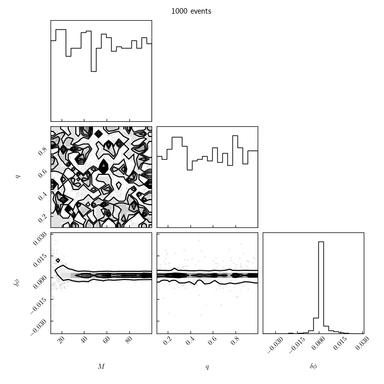
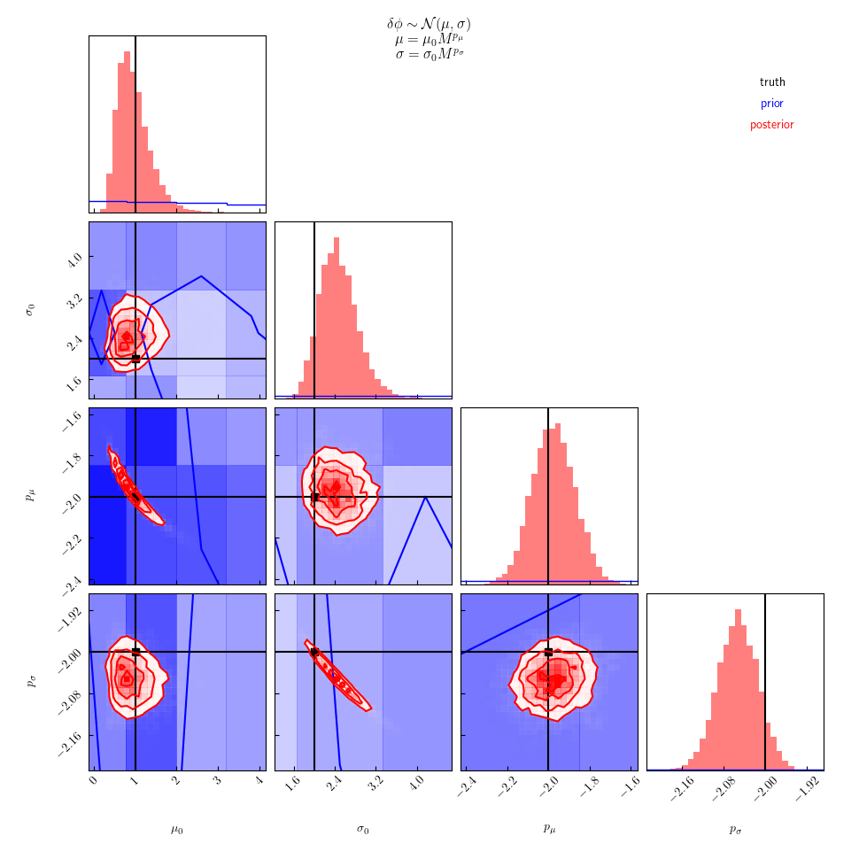
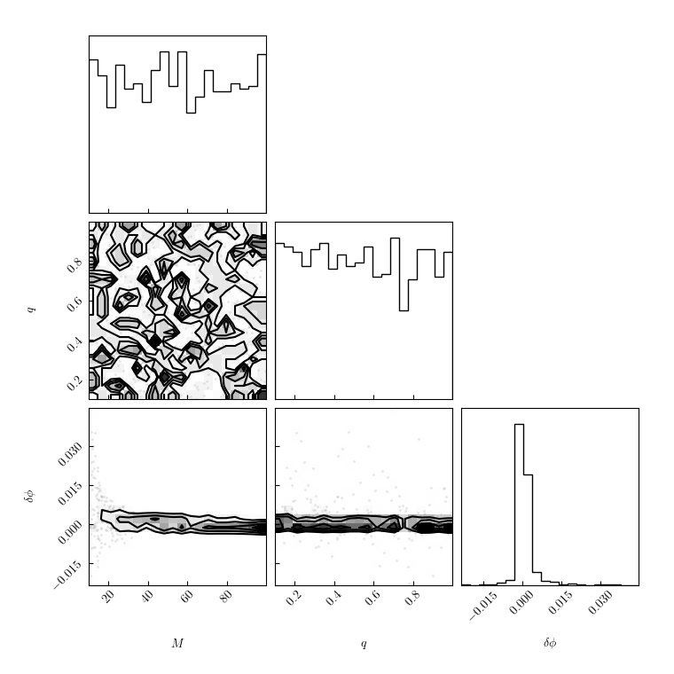
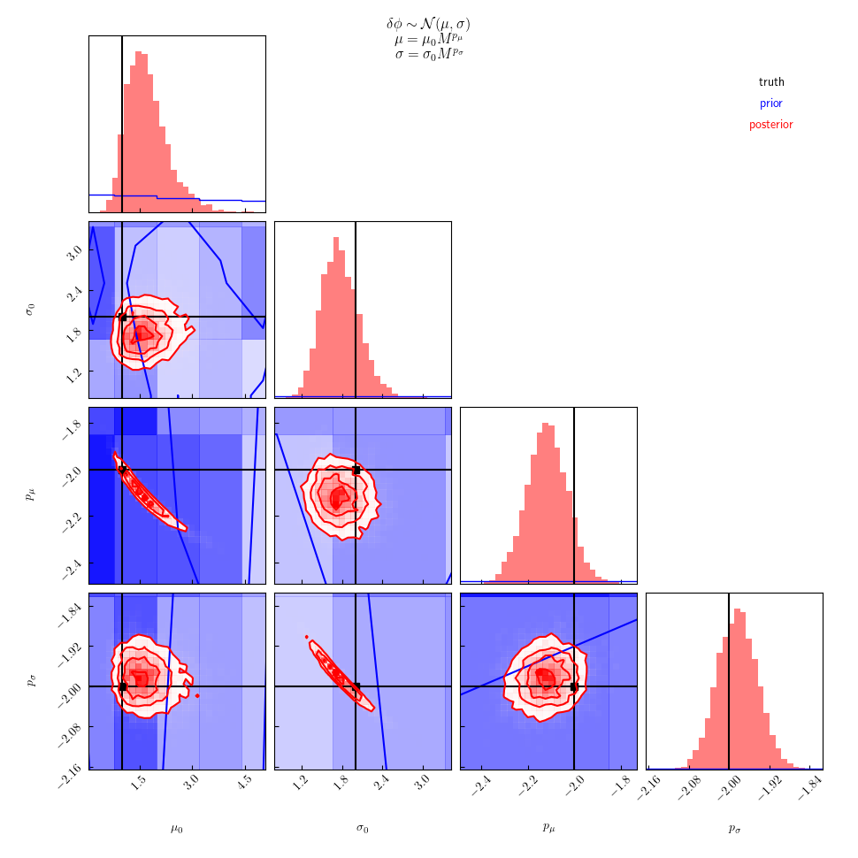
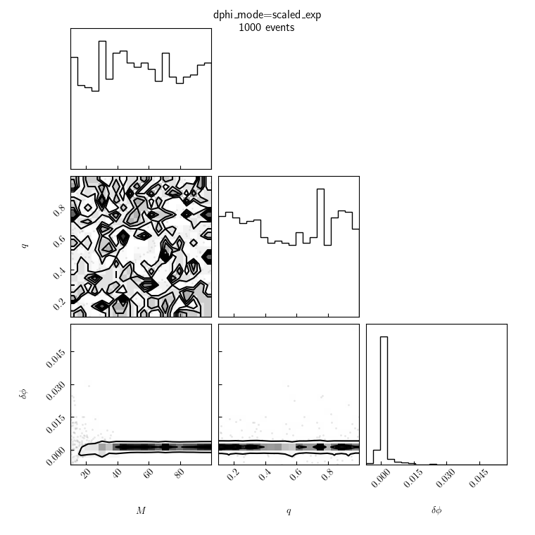
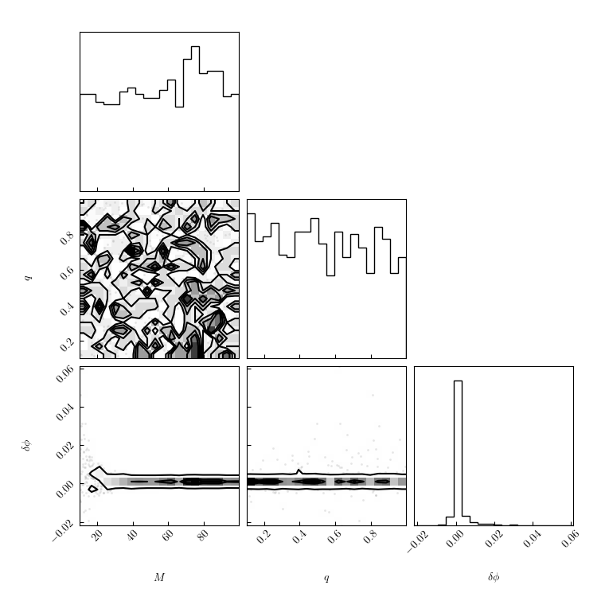
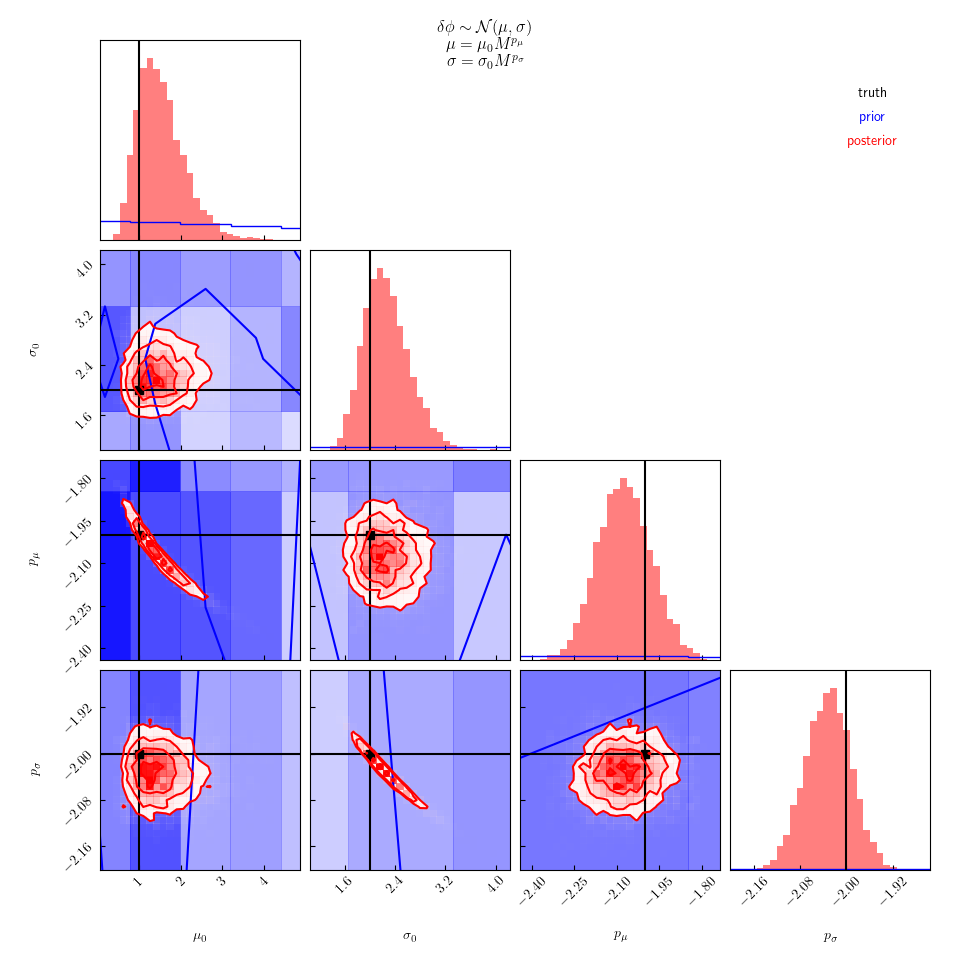

Workflow should go something like:

```
for MODE in scaled_normal scaled_exp_abs scaled_ex scaled_normal_q
do
    ./generate 1000 catalog_${MODE}.hdf -v
    ./infer catalog_${MODE}.hdf samples_${MODE}.hdf -v
done
```

**NOTE**, we may also set up p-p test to demonstrate propper coverage?

---

## Examples:

All examples are recovered using the same model:
```math
\delta\phi \sim \mathcal{N}(\mu_0 M^{p_\mu}, \sigma_0 M^{p_\sigma})
```

### `scaled_normal`

The catalog is generated with the same model that's used during recovery
```math
\delta\phi \sim \mathcal{N}(\mu_0 M^{p_\mu}, \sigma_0 M^{p_\sigma})
```

|catalog|posterior|
|---|---|
|||

### `scaled_exp_abs`

The catalog is generated with a different model than what's used during recovery.
This model is symmetric and has the correct scaling of moments with `M`.
However, it is not Gaussian.
```math
\delta\phi \sim \frac{\gamma}{2} \exp\left(-\gamma|\delta\phi - \mu|\right)
```
for which
```math
\sigma^2 = 2/\gamma^2
```
 
|catalog|posterior|
|---|---|
|||

### `scaled_exp`

This catalog is generated with a different model than what's used during recovery.
This model has the correct scaling of moments with `M`, but is asymmetric (and therefore is not Gaussian).
```math
\delta\phi \sim \frac{gamma} \exp\left(-gamma (\delta \phi - a)\right) \Theta(\delta \phi \geq a)
```
In this case
```math
\mu = a + \frac{1/\gamma}
```
and
```math
\sigma = 1/\gamma
```

|catalog|posterior|
|---|---|
|||

### `scaled_normal_q`

Finally, this catalog is generated with a different model than what's used during recovery.
The model does not have the correct scaling of moments with `M` and additionally depends on `q` in a "relatively strong" way.
The model is Gaussian.
```math
\delta\phi \sim \mathcal{N}(\mu, \sigma)
```
where
```math
\mu = \mu_0 M^{p_\mu} \left(1 - e^{2q})
```
and
```math
\sigma = \sigma_0 M^{p_\sigma} e^{2q}
```

|catalog|posterior|
|---|---|
|||
